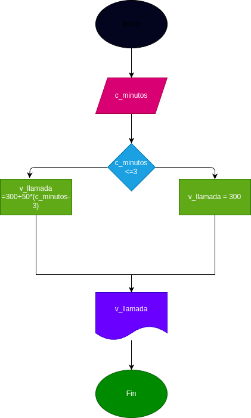

### Costo de una llamada telefonica

Ingresar el tiempo de duracion, de una llamada telefonica y determinar la cantidad apagar de acuerdo a los siguente:
-

- Toda llamada que duro 3 minutos o menos tiene un costo de 3 pesos.

- Cada minuto adicional cuesta 50 pesos.

# Desarrollador Alfonzo

- Luis Alfonzo Marquez Lopez 10-5
